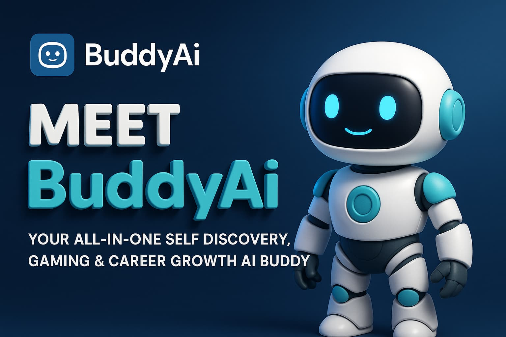
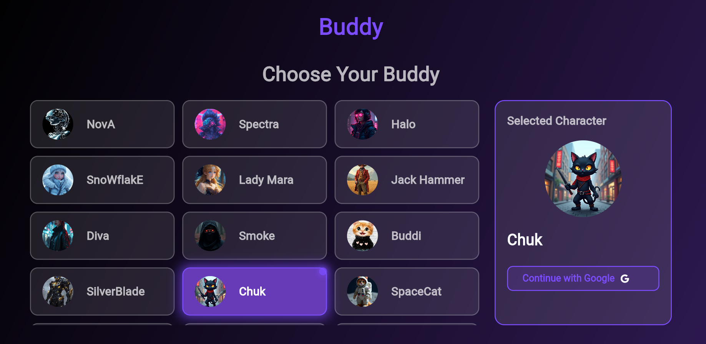
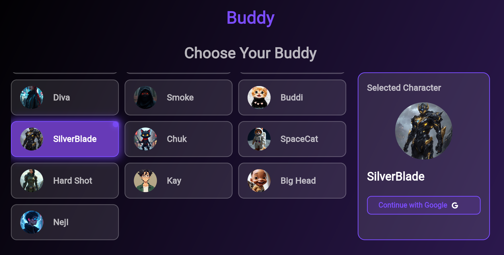
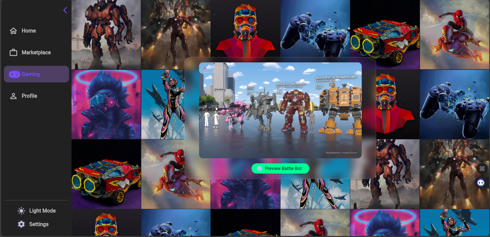
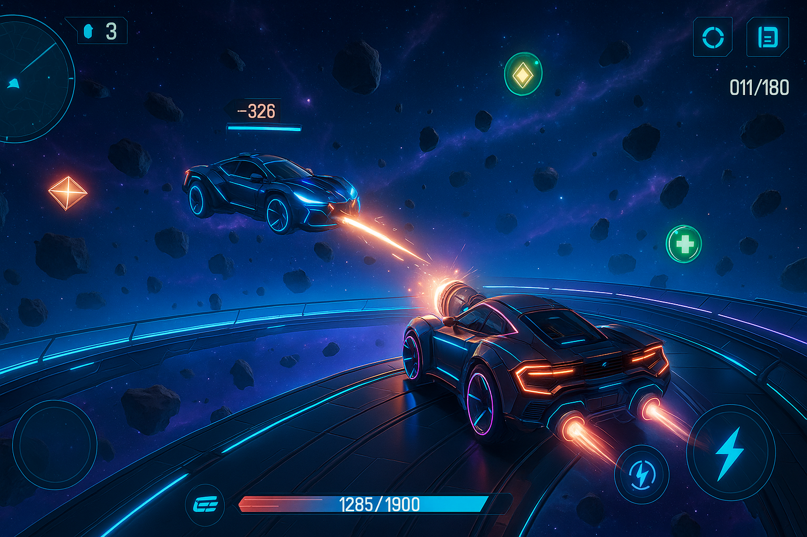
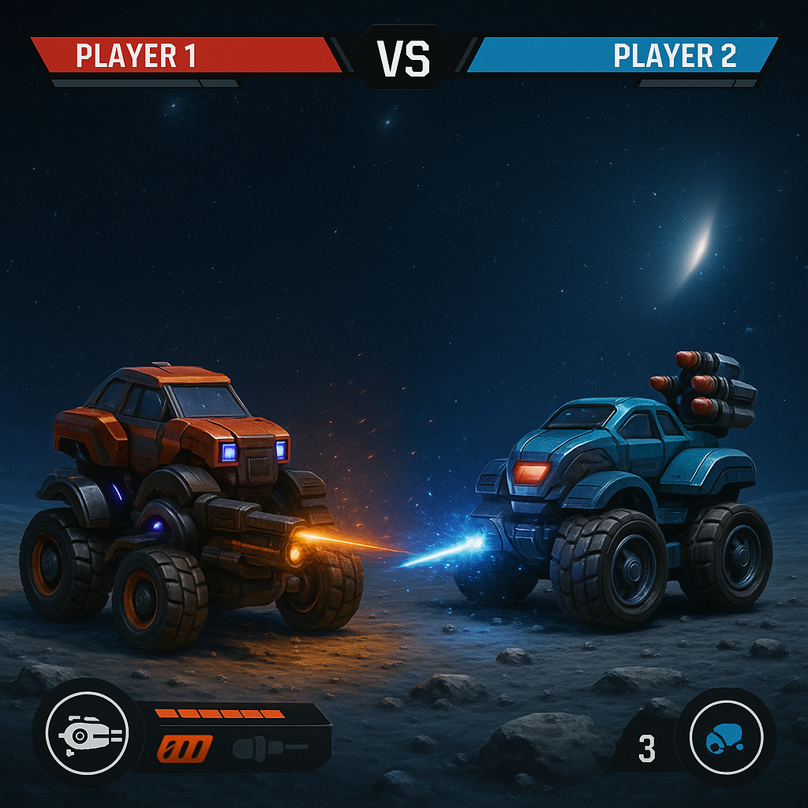

# 🤖✨ BuddyAi  
**Discover Yourself. Battle with Bots. Find Your Future.**

BuddyAi is not just an app — it's your personal AI-powered companion for self-discovery, real-world robot gaming, and career connection.

---

 <!-- 🔄 Replace with your custom banner image -->

---

## 🌟 What is BuddyAi?

**BuddyAi** is a futuristic platform that combines self-discovery, smart career guidance, immersive robot gaming, and real-world opportunities — all powered by advanced AI and AR tech.

### Core Features:
- 🤝 **Choose Your AI Buddy** — Pick from unique personas that match your vibe  
- 💬 **Talk & Discover Yourself** — Real conversations, real insights  
- 🎯 **Instant AI Recommendations** — Career, goals, personality, fashion, videos  
- ⚔️ **AR-Powered Robot Battles** — Control physical robots in competitive games  
- 💼 **Smart Marketplace** — Auto-profile & connect with jobs in your field  

---

## 🎮 Live with Physical Robots

BuddyAi supports integration with real robots using Bluetooth and Wi-Fi.

### ✅ Supported Hardware:
- `BuddyBot v1` (Bluetooth controlled)
- `Unity AR TankBot` (AR + Wi-Fi based)

### ⚙️ Communication:
- BLE or USB Serial (ESP32/Arduino-based bots)
- Real-time control via the BuddyAi mobile interface

---

## 📸 Screenshots

### App Interface
| Welcome Page | AI Chat | Personalized Dashboard |
|--------------|---------|-------------------------|
|  |  |  |

### Robot Integration
| Robot Design | AR Battle Mode |
|--------------|----------------|
|  |  |

> 📝 *Replace these placeholder images with your actual screenshots in `assets/screenshots/` and `assets/robots/`.*

---

## 📲 Getting Started

1. **Clone the Repository**
   ```bash
   git clone https://github.com/yourusername/buddyai.git
   cd buddyai
